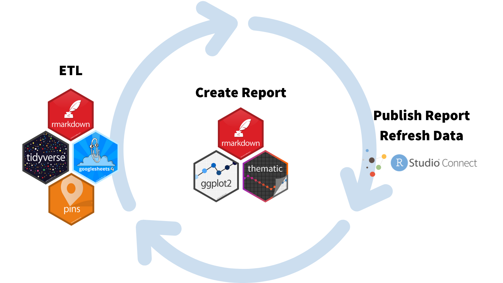

# Automated survey reporting with googlesheets4, pins, and R Markdown

Welcome to the automated survey reporting repository. We will walk through this workflow in an upcoming [RStudio Blog](https://www.rstudio.com/blog/) post.

Contents of the workflow include:

* `data/raw/ntia-analyze-table-FINAL21.csv`: Raw data pulled from the [National Telecommunications and Information Administration Data Explorer](https://www.ntia.gov/data/explorer#sel=internetUser&disp=map).
* `script/00-upload-to-googlesheets.R`: We cleaned up the spreadsheet a bit before uploading to Google Sheets. This presumably would be part of your survey reporting workflow. We separated it so that the blog post wouldn't be too long.
* `notebooks/01-etl-process.Rmd`: R Markdown document that extracts the Google Spreadsheet, transforms it, and loads it into a pin.
* `notebooks/02-plot.Rmd`: Notebook that creates a plot from the pinned data.
* `notebooks/03-plot2.Rmd:` Notebook that creates a second plot from the pinned data.
* notebooks/04-aggregate.Rmd: Notebook that knits together `-02-plot.Rmd` and `03-plot.Rmd` into a report.